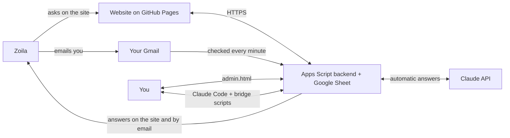

# Tutor Zoila

A private question-and-answer and tutoring site for Zoila while she learns Power BI and Python.
This guide is for you, the owner. It assumes no programming experience: follow the steps in order
and click exactly what they say. The whole setup takes about an hour.

## What you get

Zoila gets a simple Spanish website (plus a step-by-step learning guide) where she can ask questions
or send you a direct message. She can also just email you. Questions are answered automatically by
Claude, acting as a patient tutor, usually within a minute or two, on the site and by email.
Direct messages are for you: you get notified, a draft reply can be prepared, and you answer from a
private admin page, or from Claude Code, which shows you each message and posts only the replies you approve.



In words: Zoila → site or email → Apps Script and the Sheet → Claude → back to her on the site or by
email. You see everything on the admin page, or through Claude Code on your computer.

## Costs

- **Claude API (Anthropic): pay per use.** The site uses the `claude-opus-5` model, billed at
  **$5 per million input tokens and $25 per million output tokens**. A typical answer uses a few
  thousand tokens (the tutor instructions plus the conversation going in, a few hundred words coming out),
  so it costs **roughly a few cents**. Long conversations and attached screenshots cost a bit more.
- **The `dailyCap` setting protects your spending.** By default at most 40 automatic Claude calls a day.
  After that, questions wait for you until the next day. You can also set a monthly spend limit in the
  Anthropic Console.
- **Google (Sheets, Apps Script, Gmail) and GitHub Pages: free** for this kind of personal use.
- A Claude subscription (claude.ai) does **not** cover API usage: the API is billed separately, with
  prepaid credits. Using Claude Code for the bridge uses your normal Claude Code plan.

## What you need

- A Google account (the Gmail address Zoila will write to).
- A GitHub account (free) for the website.
- An Anthropic Console account with a little credit, for automatic answers.
- For step 9 only: a computer with [Node.js](https://nodejs.org) 18 or newer and Claude Code.
- This folder (`tutor-zoila`) on your computer.

---

## Step 1: Create the Google Sheet and the Apps Script project

1. Open [sheets.new](https://sheets.new) while signed in with your Google account. A blank spreadsheet opens.
2. Click **Untitled spreadsheet** (top left) and name it `Tutor Zoila`.
3. In the menu, click **Extensions → Apps Script**. A new tab opens with the script editor.
4. Click **Untitled project** (top left), name it `Tutor Zoila`, and click **Rename**.
5. In the file list on the left, `Code.gs` is open. Select everything in the editor (Ctrl+A, or Cmd+A on a Mac)
   and delete it.
6. On your computer, open `backend/Code.gs` from this folder in a text editor, copy **all** of it, and paste it
   into the Apps Script editor.
7. Click the **gear icon (Project Settings)** in the left sidebar. Tick
   **Show "appsscript.json" manifest file in editor**.
8. Click the **`< >` icon (Editor)** in the left sidebar. A new file, `appsscript.json`, is now in the file list.
   Click it, select everything, delete it, and paste the full contents of `backend/appsscript.json`.
9. Click the **Save project** icon (the floppy disk), or press Ctrl+S / Cmd+S.

## Step 2: Add your Anthropic API key

1. Go to [console.anthropic.com](https://console.anthropic.com) and sign in (it may take you to the Claude Platform site;
   the names below may differ slightly).
2. Under **Billing**, add some credit. Under **Limits**, you can also set a monthly spend limit.
3. Open **API keys**, click **Create key**, name it `tutor-zoila`, and copy the key (it starts with `sk-ant-`).
   You will only see it once.
4. Back in Apps Script, click the **gear icon (Project Settings)** and scroll down to **Script Properties**.
5. Click **Add script property** (or **Edit script properties** if some already exist).
   - Property: `ANTHROPIC_API_KEY`
   - Value: paste the key
6. Click **Save script properties**.

> Never put the API key in any file in this folder, and never commit it to GitHub. It only lives in Script Properties.

## Step 3: Run `setup()` and authorize the script

1. Click the **`< >` icon (Editor)** and open `Code.gs`.
2. In the toolbar above the code, open the function drop-down and choose **setup**. Then click **Run**.
3. An **Authorization required** box appears. Click **Review permissions** and choose your Google account.
4. You will probably see **"Google hasn't verified this app"**. That is normal: it is *your own* script,
   not a published app. Click **Advanced**, then **Go to Tutor Zoila (unsafe)**.
5. Review the permissions (Sheets, Gmail, external requests, triggers). If you see checkboxes, tick
   **Select all**. Then click **Allow** (or **Continue**).
6. The **Execution log** at the bottom shows the results. Copy these two values somewhere safe, such as a
   password manager:
   - the **student link token** (the part after `#sala=`), and
   - the **admin token**.
   The log also lists what is still missing (API key, `siteUrl`, `studentEmails`).
7. `setup()` also installed a trigger that runs every minute. You can see it under the **clock icon (Triggers)**:
   one `tick` trigger, "Time-based, every minute".

Running `setup()` again later is safe: it never replaces existing tokens or settings.

## Step 4: Deploy the backend as a web app

1. Click **Deploy** (top right) → **New deployment**.
2. Next to **Select type**, click the **gear icon** → **Web app**.
3. Fill in:
   - Description: `v1`
   - **Execute as: Me** (your address)
   - **Who has access: Anyone**. The site and the bridge must reach it without a Google sign-in. Every
     request still needs the student token or the admin token.
4. Click **Deploy** (authorize again if asked), then copy the **Web app URL**. It ends with `/exec`.
5. Open `assets/config.js` in this folder and replace
   `https://script.google.com/macros/s/PASTE_YOUR_DEPLOYMENT_ID/exec` with your URL. Keep the quotes. Save the file.

> **IMPORTANT: after any change to `Code.gs`**, go to **Deploy → Manage deployments**, select your deployment,
> click the **pencil icon (Edit)**, set **Version: New version**, and click **Deploy**. Otherwise the website
> keeps running the old code. (The every-minute trigger already uses the newly saved code, so without a new
> version the two halves disagree.) The URL stays the same.

## Step 5: Publish the website on GitHub Pages

1. On [github.com](https://github.com), click **+** (top right) → **New repository**.
2. Repository name: `tutor-zoila`. Choose **Public** (free GitHub Pages needs a public repository).
   Click **Create repository**.
3. Upload the files, in either of two ways:
   - **In the browser:** on the new repository page, click **uploading an existing file**, drag in all the files
     and folders from `tutor-zoila` (`index.html`, `guia.html`, `admin.html`, `assets`, `backend`, `bridge`, `dev`,
     and the `.md` files), and click **Commit changes**. Hidden files (starting with a dot) are not needed for the site.
     **Never upload `bridge/.env`.**
   - **With git:** `git init`, `git add .`, `git commit -m "Tutor Zoila"`, then follow the "push an existing
     repository" commands GitHub shows. `.gitignore` already keeps `bridge/.env` and local state out.
4. In the repository, click **Settings** → **Pages** (left sidebar).
5. Under **Build and deployment**: Source **Deploy from a branch**, Branch **main**, folder **/ (root)** → **Save**.
6. Wait 1–2 minutes and refresh. The page shows **"Your site is live at
   https://YOUR-USERNAME.github.io/tutor-zoila/"**.

> The repository is public, so anyone can read the code. That is fine: **no secrets live in it**. The API key
> and tokens stay in Script Properties, and `assets/config.js` only holds the web app URL, which is useless
> without a token.

## Step 6: Open the admin page and fill in Settings

1. Open `https://YOUR-USERNAME.github.io/tutor-zoila/admin.html#admin=YOUR_ADMIN_TOKEN`
   (paste the admin token from step 3). The page remembers the token in this browser and removes it from the address bar.
2. Open **Settings** and fill in:
   - **siteUrl**: `https://YOUR-USERNAME.github.io/tutor-zoila/`
   - **studentEmails**: Zoila's email address (or addresses). Only emails from these addresses are imported.
   - **notifyEmail**: where you want notifications (it can be your own Gmail). Leave it empty for no notification emails.
   - **studentName** / **tutorName**: how names appear. `tutorName` is how *you* appear to Zoila (default "Alon").
   - The autonomy switches: see [Autonomy switches explained](#autonomy-switches-explained). The defaults are a good start.
3. Save. The status strip at the top of the admin page shows whether the trigger is running and the API key is configured.

## Step 7: Send Zoila her link

Her link is **siteUrl + `#sala=` + the student link token**, for example
`https://YOUR-USERNAME.github.io/tutor-zoila/#sala=abc123...`. The admin page can build and copy it for you.

Send it to her privately. **That link is the key to the site: treat it like a password.** Anyone who has it
can read and write in her conversations. After opening it once, her browser remembers it. If it ever leaks,
rotate it (see [Rotating the link or tokens](#rotating-the-link-or-tokens)).

## Step 8: Email (optional, works automatically)

- Zoila can simply email **your Gmail address** (the account that runs the script). Once a minute, emails
  from the addresses in `studentEmails` are imported as threads and labeled **Tutor IA** in Gmail.
- If the **subject contains "directo"** (or "privado", or "para" plus your tutorName), the email becomes a
  **direct message** for you. Otherwise it is a question for the tutor.
- Replies to email threads go back by email when `emailReplies` is on. They are sent from your Gmail as
  replies in the same conversation.
- Emails sent before you ran `setup()`, or older than 30 days, are never imported.

## Step 9: The Claude Code bridge (optional)

This lets a Claude Code session on your computer watch for messages that need you. It summarizes them in
English, proposes replies in Spanish, and posts a reply **only after you approve its exact text**.

1. In this folder, copy the example settings file: `cp bridge/.env.example bridge/.env`
2. Open `bridge/.env` in a text editor and set:
   - `TUTOR_API_URL=` your web app URL from step 4 (ending in `/exec`)
   - `TUTOR_ADMIN_TOKEN=` your admin token from step 3
3. Test it: `node bridge/inbox.mjs` should list your threads.
4. Open Claude Code in this folder (`cd tutor-zoila`, then `claude`) and say:
   **"watch for Zoila's messages"**.
5. Keep the session open. When something arrives, Claude tells you who wrote and what she needs, shows a
   proposed reply, and waits for you to approve, edit or skip it. Claude Code may ask permission to run the
   `node bridge/...` commands. Allowing them is fine.

The rules the session follows are in `CLAUDE.md`. `bridge/.env` is private: it is gitignored, and you should never share it.

---

## Local testing (no accounts needed)

```
node dev/server.mjs
```

This runs the real backend code on your computer with fake Google services and serves the site at
http://localhost:8787. It prints ready-made links for the student page and the admin page. The
`bridge/.env.example` values already point at it, so `cp bridge/.env.example bridge/.env` is enough
to try the bridge locally.

To simulate an email from the student, post it to the dev server and run the trigger once:

```
curl -s -X POST http://localhost:8787/dev/email -d '{"from":"zoila@example.com","subject":"Duda","body":"¿Qué es pandas?"}'
curl -s -X POST http://localhost:8787/dev/tick
```

Other dev endpoints: `POST /dev/claude {"mode":"ok|fail|refusal|slow"}` switches the fake Claude,
`POST /dev/reset` wipes the local data, and `GET /dev/state` shows sent emails, notifications and threads.

Run the automated tests from the repo root with:

```
node --test
```

(`node --test dev/*.test.mjs` also works. Don't pass the bare folder `dev/`: Node 24 treats it as a module path and fails.)

## Autonomy switches explained

All switches are in **admin.html → Settings**.

| Setting | Default | What it does |
|---|---|---|
| `autoQuestion` | on | Claude answers **questions** automatically. Off: every question waits for you. |
| `autoDirect` | off | Claude answers **direct messages** automatically. Usually leave this off: direct messages are for you. |
| `draftDirect` | on | When a direct message arrives, Claude prepares a **draft** (never sent) for you to review. |
| `emailReplies` | on | Threads that came in by email get the answer by email too. |
| `notifyEmail` | empty | Your address for notifications. Empty means no notification emails. |
| `notifyOn` | `direct` | `direct`: email you about direct messages (with the draft). `all`: also about automatic answers. `none`: only problems (errors, cap reached). |
| `dailyCap` | 40 | Maximum automatic Claude calls per day (answers plus drafts). Drafts you request yourself don't count. |

Common setups:
- **Hands-off (default):** questions answered automatically, direct messages come to you with a draft.
- **You review everything:** turn `autoQuestion` off. Every question waits for you, and you can ask for a draft on the admin page.
- **Quiet:** `notifyOn` = `none`, and use the admin page or Claude Code when it suits you.

## Rotating the link or tokens

- **New student link:** Apps Script → **Project Settings** → **Script Properties** → **Edit script properties**
  → delete `ROOM_TOKEN` → **Save script properties**. Then run `setup()` again (step 3) and copy the new token
  from the log. The old link stops working right away. Send Zoila the new link.
- **New admin token:** same steps with `ADMIN_TOKEN`. Then open `admin.html#admin=NEW_TOKEN` again and update
  `TUTOR_ADMIN_TOKEN` in `bridge/.env`.
- **New Anthropic key:** create a new key in the Console, replace the `ANTHROPIC_API_KEY` value in Script Properties,
  then delete the old key in the Console.

None of these need a new deployment.

## Limits and quotas

Google limits free (consumer) accounts. From the [Apps Script quotas page](https://developers.google.com/apps-script/guides/services/quotas)
(last updated 2026-09-03; Google says quotas can change at any time):

| Quota (per day unless noted) | Free Google account | Google Workspace |
|---|---|---|
| Triggers total runtime | 90 min / day | 6 hr / day |
| URL Fetch calls (Claude API requests) | 20,000 / day | 100,000 / day |
| Email recipients | 100 / day | 1,500 / day |
| Gmail read/write | 20,000 / day | 50,000 / day |
| Properties read/write | 50,000 / day | 500,000 / day |
| Script runtime | 6 min / execution | 6 min / execution |
| Simultaneous executions | 30 / user | 30 / user |

What this means in practice:
- **Answers from the site usually arrive within a minute.** The site asks the backend to answer right away.
  **Answers that come from the every-minute trigger** (emails, or retries) **can take about 1–2 minutes**.
- The trigger runs 1,440 times a day, so the **90 minutes of trigger runtime** on a free account is the
  tightest limit. If it runs out, email checks and background retries pause until Google resets the quota
  (about a day later). The admin status strip shows when the trigger last ran.
- 100 email recipients a day covers replies to Zoila plus notifications to you, with plenty to spare.

## Troubleshooting

| What you see | Likely cause | What to do |
|---|---|---|
| The site says it is **not connected** | `assets/config.js` still has `PASTE_YOUR_DEPLOYMENT_ID`, or GitHub Pages has not updated yet | Paste the `/exec` URL (step 4), commit, wait 1–2 minutes, and reload with Ctrl+Shift+R / Cmd+Shift+R. |
| **Unauthorized** on the student site | The link is wrong or was rotated | Send Zoila the current link from the admin page. |
| **Unauthorized** on the admin page or in the bridge | Wrong admin token | Open `admin.html#admin=TOKEN` again, or fix `TUTOR_ADMIN_TOKEN` in `bridge/.env`. |
| **Answers never arrive** | The trigger isn't running, the API key is missing or invalid, credit ran out, the daily cap was reached, or answers keep failing | Look at the admin **status strip**: if `lastTickAt` is old, check **Triggers** in Apps Script (run `setup()` again). If the API key shows not configured, redo step 2. Read **lastError** (for example an invalid key or low credit balance). Check the cap. In Apps Script, open **Executions** (left sidebar) to see failed runs and their errors. |
| **Emails aren't imported** | Her address isn't in `studentEmails`, the email is older than setup (`INTAKE_SINCE`) or 30 days, or she wrote from another address | Check `studentEmails` spelling (all lowercase) and the exact sender address. Only new emails after `setup()` are imported. Imported emails get the **Tutor IA** label. |
| **Code changes aren't live** | No new deployment version | **Deploy → Manage deployments → Edit (pencil) → Version: New version → Deploy.** For site files, wait for GitHub Pages and hard-reload. |
| The bridge says Google showed a **sign-in page** | Web app access isn't "Anyone" | **Deploy → Manage deployments → Edit →** Who has access: **Anyone**. |
| The bridge says **not configured** | No `bridge/.env` | Do step 9. |
| "Google hasn't verified this app" | Normal for your own script | **Advanced → Go to Tutor Zoila (unsafe)**. |
| Errors like "You do not have permission to call …" | The script needs new permissions after an update | Run `setup()` again in the editor and allow the permissions. |

## Privacy notes

- **Where the data lives:** conversations are stored in *your* Google Sheet. Emails stay in *your* Gmail. Nothing
  is stored on GitHub: the site only holds code.
- **Who sees it:** you (admin page, Sheet, Gmail) and Zoila (through her link). To write answers, the conversation
  text (and any screenshots she attaches by email) is sent to Anthropic's API. See Anthropic's commercial terms and
  privacy policy for how API data is handled. When you use the bridge, messages also appear in your Claude Code session.
- **The links are keys:** the student link and the admin token work like passwords. The part after `#` is not sent
  to GitHub's servers, and the pages remove it from the address bar after the first visit. Rotate a token if it leaks.
- **Gmail access:** the script asks for permission to read and send mail from your account, because that is how
  email intake and replies work. It only imports messages from the addresses in `studentEmails`.
- **Deleting:** you can delete a thread from the admin page. Deleting the Google Sheet removes all stored conversations.
  To shut everything down, archive the deployment (**Deploy → Manage deployments → Archive**) and delete the trigger.
- The tutor is told never to ask Zoila for passwords or private data, and to remind her if she pastes something private.
